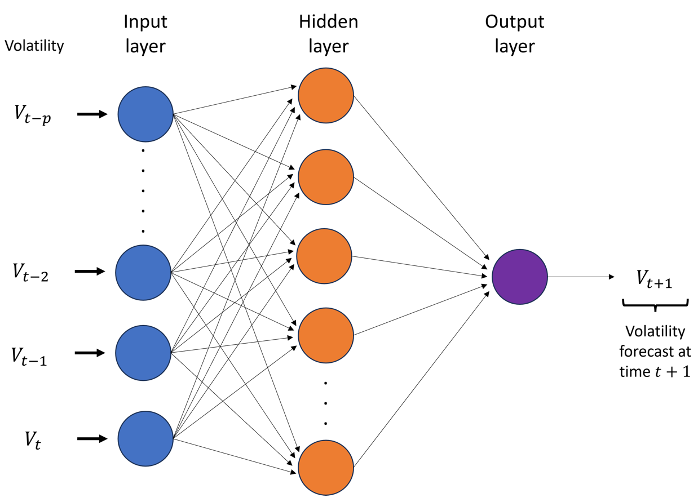
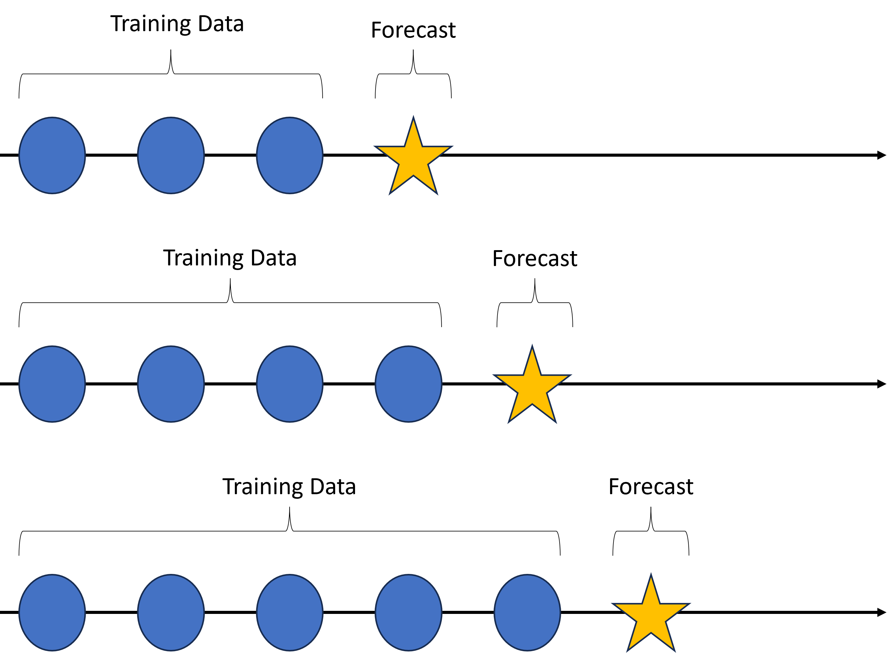

# Novel Resilient Model Risk Forecasts based on Neuro Volatility Models

Recently, there has been a growing interest in using neuro volatility models in fuzzy forecasting and fuzzy option pricing. Neuro volatility models are used to model and predict financial market volatility by extending the neural network autoregressive (NNAR) model for nonlinear nonstationary time series data. In financial risk forecasting, various risk forecasting models for volatility are used to obtain the volatility forecasts, and the model risk ratio based on all the models is calculated to assess the stability of the financial system. However, the recently proposed neuro volatility models (based on neural networks such as LSTM, NNAR, etc.) are not used in evaluating the model risk. In this study, novel `neuro model risk forecasts' are obtained by including recently proposed neuro volatility models, and the resiliency of the financial system is studied.

The PDF copy of the paper can be downloaded from here: [Download Paper](https://ieeexplore.ieee.org/abstract/document/9918212) 

A preprint version of the paper is available in the repository.

Programming Language: [R](https://cran.r-project.org/bin/windows/base/) / [RStudio](https://posit.co/downloads/)

Data: The provided R codes download financial data directly from [Yahoo!Finance](https://ca.finance.yahoo.com/). The meteorological data used is available in the CSV file in the repository. The source of meteorological data is [Renewables.ninja](https://www.renewables.ninja/).

### Methodology

The novelty of this study is to obtain direct volatility forecasts using neural network models while taking basic time series models and autoregressive models into account. 
We introduce neuro model risk forecasts based on direct volatility forecasts, which allow more appropriate nonlinear nonstationary neuro volatility forecasting models. The work investigates the stability of the forecasts of different models, considering the proposed neuro model risk. Moreover, we investigate the models' performance in price forecasts using adjusted closing price data of Google, CBOE Volatility Index (VIX), and Bitcoin-USD.

When applying autoregression and machine learning models for time series data, a common approach is to evaluate the performance/accuracy of models by considering observed and forecast data. In this study, MAE, RMSE, and MAPE are used as measures of forecast errors.

#### Neuro Volatility Models

In finance, stock prices are modeled as a geometric Brownian motion, where the stock prices are denoted as $P_t$, $t = 1, \ldots, T$. 
The first step when modeling volatility is to transform the adjusted closing prices $P_t$ and calculate the log returns. Then, calculate the mean of the log returns, denoted $\bar{r}$. 
We will then compute the correlation between $r_t-\bar{r}$ and $sign(r_t-\bar{r})$ denoted as $\hat{\rho} = corr(r_t-\bar{r}, sign(r_t-\bar{r}))$, then compute the observed volatility $V_t = |r_t-\bar{r}|/\hat{\rho}$. The observed volatility formula stems from the unbiased estimator of the standard deviation.
The observed volatility can then be used as the input time series to fit the neural network model; the fitted neural network model with the volatility series as the training data can forecast future volatility of the stock/cryptocurrency prices.

The Figure below provides a general representation of a neural network with one hidden layer. The network forecasts volatility at time $t+1,$ $V_{t+1},$ using lag values of observed volatility ($V_{t}, V_{t-1}, \ldots , V_{t-p}$).



#### Neuro Model Risk

The model risk of risk models has been introduced by Danielson et. al. in 2016. Suppose we want to forecast risk for the day $t + 1$ based on the information available on day $t.$ Considering we have $N$ candidate models to forecast risk on day $t + 1,$ each providing different forecasts. Then the model risk is defined as the ratio of the highest to the lowest risk forecasts.
```math
\text{Model risk}=\text{Risk Ratio}_{t+1}=\dfrac{\text{max}\{\text{Risk}^{n}_{t+1}\}^{N}_{n=1}}{\text{min}\{\text{Risk}^{n}_{t+1}\}^{N}_{n=1}}.
```
where $N$ indicates the number of different risk measures calculated using forecasts. A model risk ratio close to one indicates that the financial system is stable.

#### Time Series Cross-Validation

It is important to note that traditional cross-validation techniques such as $K$-Fold and Leave-One-Out can not be used for time series data, as we are required to protect the correlation structure of the time series data and bring its information to the model. One way to implement cross-validation is by averaging over the test sets. It is commonly known as time-series cross-validation/evaluation on a rolling forecasting origin. In this approach, first, obtain a one-step-ahead forecast using the first few observations (training data). Second, again one-step-ahead forecast is obtained by adding one more observation to the training data. We continuously do this until the second last observation is added to the training data. Here, the training data set gradually grows. This approach can be modified to allow multi-step ahead forecasts, and the performance of a given model can be compared in terms of one-step ahead forecasts or multi-step ahead forecasts. This approach is much better than the single split because, in the single split, we only have one observation for each of the forecast horizons, and here, we have multiple observations.



### Findings

The existing model risk ratio forecast is based on linear volatility models, whereas the proposed neuro model risk forecasts allow more appropriate nonlinear, nonstationary neuro volatility forecasting models. Extensive experimental studies on price forecasts, volatility forecasts, and temperature forecasts show that the neuro model risk ratio forecast can effectively be used as a metric to assess the resilience and stability of a given financial system.

### References

1. R. J. Hyndman and G. Athanasopoulos, Forecasting: principles and practice, 3rd edition, OTexts: Melbourne, Australia. OTexts.com/fpp3, 2021.
2. Thavaneswaran, A., Paseka, A., \& Frank, J. (2020). Generalized value at risk forecasting. Communications in Statistics-Theory and Methods, 49(20), 4988-4995.
3. Danielsson, J., James, K. R., Valenzuela, M., \& Zer, I. (2016). Model risk of risk models. Journal of Financial Stability, 23, 79-91.


